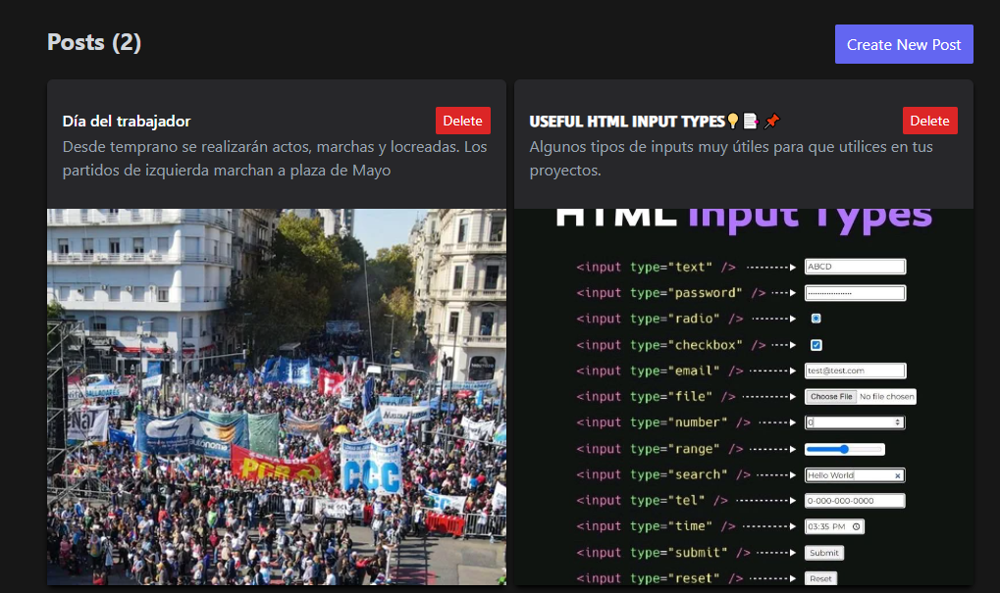

# Mern-Context-Crud
Este es un proyecto de App CRUD realizado con el stack MERN (MongoDB, Express, React y Node), 
y se utilizó TailwindCSS para los estilos. La funcionalidad de la aplicación es 
permitir a los usuarios realizar publicaciones similares a un pequeño foro de noticias.

 
